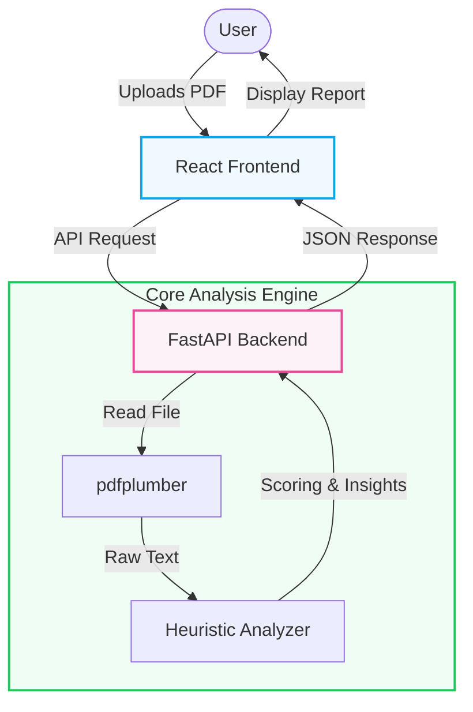

# 📄 AI Resume Analyzer

[](https://fastapi.tiangolo.com/)
[](https://reactjs.org/)
[](https://tailwindcss.com/)
[](https://www.python.org/)

**AI Resume Analyzer** is a powerful tool designed to help job seekers optimize their resumes for Applicant Tracking Systems (ATS). It extracts text from PDF resumes, analyzes key skills, and provides a comprehensive score along with actionable improvement suggestions.

---

## 🏗️ System Architecture

The application follows a decoupled client-server architecture, ensuring scalability and a smooth user experience.



## 📂 Project Structure

The project is divided into two main components:

### 💻 Client (Frontend)
- **Framework**: React 18 with Vite.
- **Styling**: Tailwind CSS for a modern, responsive UI.
- **Features**: Drag-and-drop file upload, real-time score visualization, and organized suggestion cards.

### ⚙️ Server (Backend)
- **Framework**: FastAPI (Python).
- **Extraction**: `pdfplumber` for robust text extraction from PDF documents.
- **Analysis**: A heuristic engine that identifies technical skills, evaluates resume structure, and calculates an ATS-friendly score.

## ✨ Key Features

- **🚀 Instant Analysis**: Get your resume score and feedback in seconds.
- **🔍 Skill Extraction**: Automatically identifies technical keywords from your resume.
- **📈 ATS Scoring**: Calculates a score based on industry standards for resume optimization.
- **💡 Actionable Suggestions**: Provides specific tips to improve your resume's impact.
- **📱 Responsive UI**: Works perfectly on desktops, tablets, and mobile devices.

## 🚀 Getting Started

### Backend Setup
1. Navigate to the `server` directory.
2. Install dependencies:
   ```bash
   pip install -r requirements.txt
   ```
3. Run the server:
   ```bash
   python main.py
   ```

### Frontend Setup
1. Navigate to the `client` directory.
2. Install dependencies:
   ```bash
   npm install
   ```
3. Start the development server:
   ```bash
   npm run dev
   ```

## 🛠️ Tech Stack

- **Frontend**: React, Vite, Tailwind CSS, Lucide React, Framer Motion
- **Backend**: Python, FastAPI, Uvicorn
- **Libraries**: pdfplumber, python-dotenv

## 👨‍💻 Author

**Kartik Shete**
- GitHub: [@kartikshete](https://github.com/kartikshete)

---
*Helping candidates build better resumes, one byte at a time.*

<!-- Documentation update 0 -->
<!-- Documentation update 13 -->